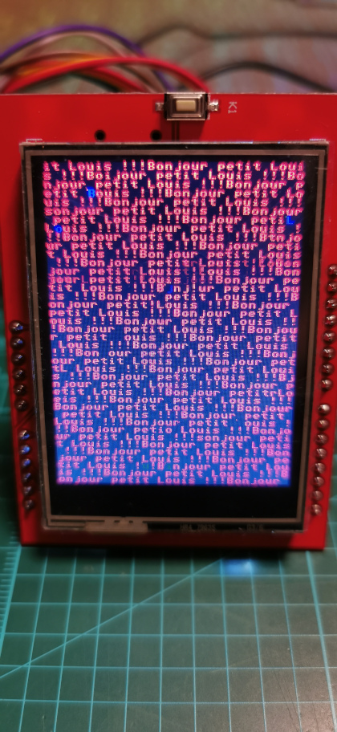

# Screen SKU:MAR2406, ILI9341

## Description




This program demonstrates the possibility of using the SKU:MAR2406 to display some information from
the Raspberry PI Pico RP2040.  

Not yet tested:  
-The tactile screen  
-The micro SDCard reader

### Prerequisite

The Raspberry PI Pico C/C++ SDK:  
<https://datasheets.raspberrypi.org/pico/raspberry-pi-pico-c-sdk.pdf>  
<https://github.com/raspberrypi/pico-sdk>

The SKU:MAR2406:  
<http://www.lcdwiki.com/2.4inch_Arduino_Display> for technical information, because this demo is adapted for the RP2040.  
<https://cdn-shop.adafruit.com/datasheets/ILI9341.pdf> the data sheet of the ILI9341 (the screen)

### Documentation

### View log debug

```bash
sudo minicom -b 115200 -o -D /dev/ttyACM0
```

### Reminder pins voltage from Raspberry Pi Pico

| Pin | Label | Description                         |
|-----|-------|-------------------------------------|
| 40  | VBUS  | USB input voltage, typically 5V     |
| 39  | VSYS  | System power, between 1,8V and 5.5V |
| 38  |  3V3  | 3,3V                                |

### Reminder debug pins connection to the raspberry

***If you experience some connection problem, verify that your Raspberry Pi Pico is connected directly to your Raspberry Pi, not the breadboard.***

| Raspberry Pi     | Raspberry Pi Pico |
|------------------|-------------------|
| GND (pin 20)     | SWD GND           |
| GPIO 24 (pin 18) | SWDIO             |
| GPIO 25 (pin 22) | SWCLK             |

#### UART CONNECTION

| Raspberry Pi      | Raspberry Pi Pico |
|-------------------|-------------------|
| TxD UART (pin 8)  | UART0 RX (pin 2)  |
| RxD UART (pin 10) | UART0 TX (pin 1)  |
| GND      (pin 12) | GND (pin 3)       |

#### Pins correspondence between the ILI9341 and the SKU:MAR2406

| ILI9341     | SKU:MAR2406| Description    |
|-------------|------------|----------------|
|    RESX     | LCD_RST    | reset          |
|    CSX      | LCD_CS     | chip select    |
|    D/CX     | LCD_RS     | command/status |
|    WRX      | LCD_WR     | write          |
|    RDX      | LCD_RD     | read           |

#### Connections from SKU:MAR2406 to the Raspberry Pi Pico

| SKU:MAR2406      | GPIO on the RP2040 | PIN |
|-----------------:|-------------------:|----:|
|  LCD_RST         |  17                | 22  | 
|  LCD_CS          |  18                | 24  |
|  LCD_RS          |  19                | 25  |
|  LCD_WR          |  20                | 26  |
|  LCD_RD          |  21                | 27  |
|  GND             | GND                |     |
|  5V              | VBUS               |     |
|  3V3             | VSYS               |     |
|  LCD_D0          |   2                |  4  |
|  LCD_D1          |   3                |  5  |
|  LCD_D2          |   4                |  6  |
|  LCD_D3          |   5                |  7  |
|  LCD_D4          |   6                |  9  |
|  LCD_D5          |   7                | 10  |
|  LCD_D6          |   8                | 11  |
|  LCD_D7          |   9                | 12  |

## Characters

The characters matrix come from a Commodore 64.  Every char is a matrix of 8 x 8 bits.  
I am inviting you to consult the file c64charset for more information.

### Mapping ASCII offset

| Char | ASCII |   Offset |
|------|------:|---------:|
| SPC  |   32  |      256 |
|  !   |   33  |      264 |
| ...  |  ...  |      ... |
|  ?   |   63  |      504 |
|  @   |   64  |        0 |
|  A   |   65  |        8 |
|  B   |   66  |       16 |
| ...  |  ...  |      ... |
|  Z   |   90  |      208 |
|  [   |   91  |      216 |
|  \   |   92  | (*1*)224 |
|  ]   |   93  |      232 |  
|  ^   |   94  | (*2*)240 |
|  _   |   95  | (*3*)248 |
|  `   |   96  | (*4*)256 |
|  a   |   97  |     2056 |
|  ... |  ...  |      ... |
|  z   |  122  |     2256 |

Graphic char from offset 512 until 1016 include

*1* sterling sign  
*2* up arrow sign  
*3* left arrow sign  
*4* SPC
